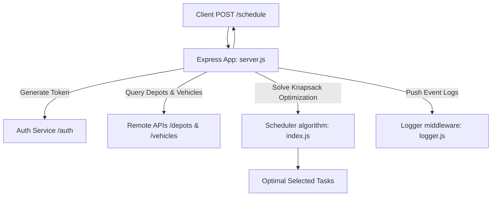
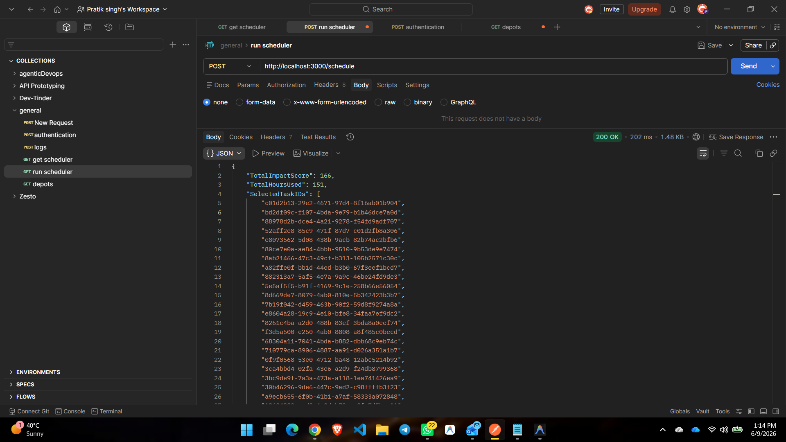

# AffordMed Vehicle & Notifications Monorepo

This workspace houses the notification services and the optimization-driven scheduler services for vehicle maintenance.

---

## 📂 Repository Structure

* **`vehicle_maintence_scheduler/`**: The core optimization module and REST API for scheduling vehicle maintenance tasks based on depot capacity.
* **`logging middleware/`**: Middleware layer used for publishing operational event logs to the central evaluation logging server.
* **`public/`**: Public assets and execution screenshots demonstrating successful API outputs.

---

## ⚙️ Vehicle Maintenance Scheduler Implementation

The scheduler service computes the most impactful maintenance tasks to execute within the available mechanic capacity across all active depots.

### System Flow Diagram



### Key Technical Details

1. **Authentication Flow**: To prevent authorization failures (HTTP 401), the service dynamically retrieves short-lived JWT credentials from `http://4.224.186.213/evaluation-service/auth` at runtime and caches them.
2. **Optimization Engine**: Models task allocation as a **0/1 Knapsack Problem**. The total mechanic hours represent the knapsack capacity ($W$), and each vehicle's maintenance task has a specific duration ($w$) and impact score ($v$). A 2D Dynamic Programming matrix calculates the maximum achievable impact within the capacity boundaries.
3. **Resilient Logging**: Operational events (successes, database outputs, route calls, errors) are forwarded to the centralized evaluation log servers. It automatically truncates message payloads to **48 characters** to conform to strict endpoint constraints.

### Execution Screenshot



---

## 🚀 How to Run the Scheduler

1. **Install Dependencies**:
   ```bash
   npm install
   ```

2. **Start the Express API Server**:
   ```bash
   node vehicle_maintence_scheduler/server.js
   ```

3. **Trigger Scheduler Run**:
   ```bash
   curl -X POST http://localhost:3000/schedule
   ```
